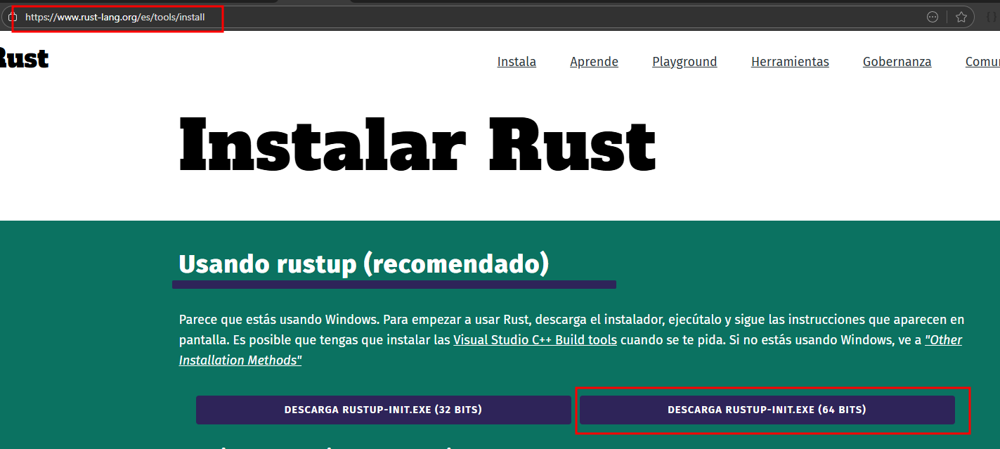
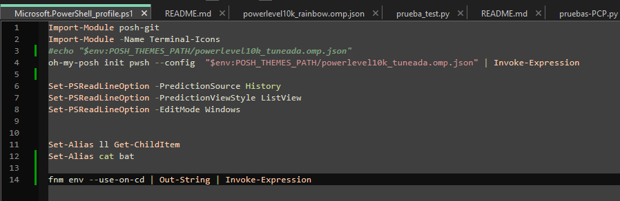

# curso-javascript-node-express

Scripts curso JavaScript [CURSO DE NODE.JS DESDE CERO](https://www.youtube.com/watch?v=yB4n_K7dZV8) de [@midudev](https://www.youtube.com/@midudev/).

## Instalación de NodeJS.

Procedimiento de instalación de Node en Windows.

### Instalación de RUST.

Aunque no es obligatorio si parece ineresante instalar RUST antes de instalar **fnm**.



### Instalación de FNM.

**FNM** es un gestor de versiones de **NodeJS**.

Para instalarlo desde windows, en **PowerShell**:

```console
winget install Schniz.fnm
```

### Configuración de **ENVIROMENT** en **PowerShell**:

Añadir la siguiente linea en **Microsoft.PowerShell_profile.ps1**.


```console
fnm env --use-on-cd | Out-String | Invoke-Expression
```



### Instalación de NodeJS.

Comprobamos las instalaciones de NodeJS:

```console
PS C:\Users\ntsja> fnm list
* v18.17.0 default
* v22.19.0
* system
PS C:\Users\ntsja>
```

Inslalamos una nueva versión:

```console
PS C:\Users\ntsja> fnm install 22.19.0
Installing Node v22.19.0 (x64)
warning: Version already installed at "C:\\Users\\ntsja\\AppData\\Roaming\\fnm\\node-versions\\v22.19.0"
PS C:\Users\ntsja> fnm install 18.16.0
Installing Node v18.16.0 (x64)
00:00:03 ██████████████████████████████████████████████████████████████████████████████████████████████████████████████████████████████████████████████ 27.81 MiB/27.81 MiB (7.94 MiB/s, 0s)
PS C:\Users\ntsja>
```

Seleccionamos versión:

```console
PS C:\Users\ntsja> fnm use 18.17.0
Using Node v18.17.0
PS C:\Users\ntsja> fnm list
* v18.16.0
* v18.17.0 default
* v22.19.0
* system
PS C:\Users\ntsja>
```

Seteamos versión por defecto;

```console
PS C:\Users\ntsja> fnm alias 18.17.0 default
PS C:\Users\ntsja>
```

Verificamos la versión de node:

```console
PS C:\Users\ntsja> node --version
v18.17.0
PS C:\Users\ntsja>
```